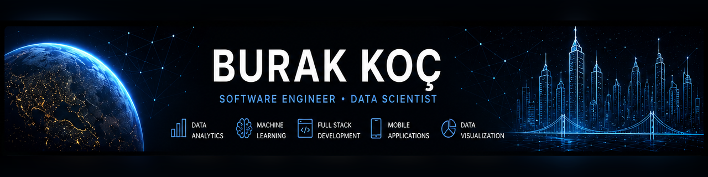

  

<h1 align="center">Hi, I'm Burak Koç 👋</h1>

  <strong>Applied AI & Software Developer • Computer Vision • Data Engineering</strong> 
  Research prototypes • Reliable APIs • Analytics • Mobile • Full Stack

  
  
  

---

## About Me

I am a **Management Information Systems graduate** focused on building end-to-end software products that combine data, artificial intelligence, APIs, mobile applications, and modern web technologies.

My work spans applied machine learning, computer vision, data engineering, analytics, Flutter development, and full-stack product development. I enjoy turning real-world problems into practical, measurable, and well-documented software solutions.

- 📍 Based in **Samsun, Türkiye**
- 🎓 B.Sc. in **Management Information Systems**, Karadeniz Technical University
- 🧠 Focused on **Applied AI, Computer Vision, Data Engineering, and Analytics**
- 📱 Building mobile products with **Flutter and Dart**
- ⚙️ Developing APIs and backend services with **Python and FastAPI**
- 🌍 Open to remote opportunities and on-site roles in Samsun, Istanbul, and Ankara

---

## Tech Stack

  

  
  
  
  
  
  
  

---

## Featured Projects

<table>
  <tr>
    <td width="50%" valign="top">
      <h3><a href="https://github.com/BurakKocDev/DentXplain">DentXplain</a></h3>
      
Anatomy-constrained panoramic dental X-ray research prototype with pathology detection, calibrated review levels, and FDI numbering.

      
<code>Medical Imaging</code> <code>YOLO</code> <code>FastAPI</code> <code>FDI</code>

    </td>
    <td width="50%" valign="top">
      <h3><a href="https://github.com/BurakKocDev/FractureLens">FractureLens</a></h3>
      
Duplicate-aware fracture classification, localization, calibration, and fused inference with an auditable web research demo.

      
<code>Computer Vision</code> <code>PyTorch</code> <code>YOLO</code> <code>Calibration</code>

    </td>
  </tr>
  <tr>
    <td width="50%" valign="top">
      <h3><a href="https://github.com/BurakKocDev/DevGuard-AI">DevGuard AI</a></h3>
      
Local-first security and code-quality orchestration with deterministic policy gates, privacy-preserving reports, and SARIF output.

      
<code>DevSecOps</code> <code>Python</code> <code>SARIF</code> <code>Static Analysis</code>

    </td>
    <td width="50%" valign="top">
      <h3><a href="https://github.com/BurakKocDev/SmartWaste-Vision">SmartWaste Vision</a></h3>
      
Offline waste classification across PyTorch, ONNX, LiteRT, and Flutter, with measured accuracy and runtime trade-offs.

      
<code>Edge AI</code> <code>PyTorch</code> <code>Flutter</code> <code>ONNX</code>

    </td>
  </tr>
  <tr>
    <td width="50%" valign="top">
      <h3><a href="https://github.com/BurakKocDev/KentLens">KentLens</a></h3>
      
End-to-end urban data platform combining Python ETL, PostgreSQL, Power BI, FastAPI, and data-quality workflows.

      
<code>Data Engineering</code> <code>PostgreSQL</code> <code>Power BI</code> <code>FastAPI</code>

    </td>
    <td width="50%" valign="top">
      <h3><a href="https://github.com/BurakKocDev/AfetLens">AfetLens</a></h3>
      
Real-time earthquake monitoring platform for Türkiye and nearby regions with interactive maps, filters, analytics, and USGS data.

      
<code>TypeScript</code> <code>Next.js</code> <code>Leaflet</code> <code>Open Data</code>

    </td>
  </tr>
</table>

  

---

## What I Build

| Area | Focus |
|---|---|
| **Applied AI & Computer Vision** | Model training, evaluation, explainability, API deployment, and mobile integration |
| **Data Engineering & Analytics** | ETL pipelines, SQL, validation, anomaly detection, dashboards, and decision support |
| **Mobile Development** | Flutter applications, REST integration, local persistence, testing, and performance |
| **Backend & Full Stack** | FastAPI, Flask, PostgreSQL, authentication, API design, and modern web frontends |

---

## Explore My Work

  

  <strong>Turning data into insight, code into impact, and ideas into real-world products.</strong>

