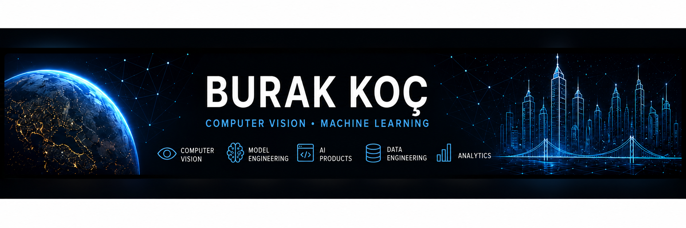

  

<h1 align="center">Hi, I'm Burak Koç 👋</h1>

  <strong>Computer Vision & Machine Learning Engineer</strong> 
  I build reproducible models, reliable APIs, and user-facing AI products.

  
  
  

---

## What I Do

I am a Management Information Systems graduate based in Samsun, Türkiye. My main
focus is taking applied AI projects through the complete engineering lifecycle:
dataset auditing, leakage-safe splitting, model training, calibrated evaluation,
API delivery, visual interfaces, and reproducible documentation.

- **Computer vision:** classification, object detection, medical imaging, edge AI
- **ML engineering:** PyTorch, YOLO, ONNX/LiteRT, calibration, experiment design
- **Product delivery:** FastAPI, React/Next.js, Flutter, Docker, CI and CodeQL
- **Data systems:** Python ETL, PostgreSQL, Power BI, validation and analytics

I am open to ML, computer vision, data, and software engineering opportunities.

---

## Evidence at a Glance

| Project | Verifiable result | Product surface |
|---|---|---|
| **FractureLens** | DenseNet121 test AUROC **0.912**; calibrated classification + localization | FastAPI and browser demo |
| **DentXplain** | C1 final-cohort F1 **0.463**; conditional FDI accuracy **0.957** | Annotated panoramic X-ray review UI |
| **SmartWaste Vision** | **90.80%** test accuracy; PyTorch → ONNX → LiteRT comparison | Offline Flutter application |
| **KentLens** | Reproducible urban ETL/API pipeline; **18/18** tests passing | Power BI and FastAPI |

> Medical-imaging projects are research prototypes and are not intended for diagnosis or treatment decisions.

---

## Featured Projects

<table>
  <tr>
    <td width="50%" valign="top">
      <h3><a href="https://github.com/BurakKocDev/DentXplain">DentXplain</a></h3>
      
An anatomy-constrained panoramic dental X-ray pipeline for pathology detection, FDI numbering, confidence tiers, and auditable review.

      
<code>Medical Imaging</code> <code>YOLO</code> <code>FastAPI</code> <code>FDI</code>

    </td>
    <td width="50%" valign="top">
      <h3><a href="https://github.com/BurakKocDev/FractureLens">FractureLens</a></h3>
      
A duplicate-aware fracture system combining calibrated classification, local detection, fusion logic, error analysis, and a visual demo.

      
<code>PyTorch</code> <code>DenseNet121</code> <code>YOLO</code> <code>Calibration</code>

    </td>
  </tr>
  <tr>
    <td width="50%" valign="top">
      <h3><a href="https://github.com/BurakKocDev/DevGuard-AI">DevGuard AI</a></h3>
      
A local-first DevSecOps orchestrator that converts real scanner output into deterministic policy decisions, SARIF, and privacy-preserving reports.

      
<code>Python</code> <code>DevSecOps</code> <code>SARIF</code> <code>React</code>

    </td>
    <td width="50%" valign="top">
      <h3><a href="https://github.com/BurakKocDev/SmartWaste-Vision">SmartWaste Vision</a></h3>
      
An offline waste classifier with measured accuracy, latency, and model-size trade-offs across PyTorch, ONNX Runtime, LiteRT, and Flutter.

      
<code>Edge AI</code> <code>ONNX</code> <code>LiteRT</code> <code>Flutter</code>

    </td>
  </tr>
  <tr>
    <td width="50%" valign="top">
      <h3><a href="https://github.com/BurakKocDev/KentLens">KentLens</a></h3>
      
An urban analytics platform joining tested Python ETL, PostgreSQL, FastAPI, data-quality controls, and decision-oriented Power BI reporting.

      
<code>Data Engineering</code> <code>PostgreSQL</code> <code>Power BI</code>

    </td>
    <td width="50%" valign="top">
      <h3><a href="https://github.com/BurakKocDev/AfetLens">AfetLens</a></h3>
      
A real-time earthquake monitoring experience for Türkiye and nearby regions, with explicit live/sample-data states and interactive analysis.

      
<code>TypeScript</code> <code>Next.js</code> <code>Leaflet</code> <code>USGS</code>

    </td>
  </tr>
</table>

---

## Engineering Principles

- Freeze data splits and thresholds before final evaluation.
- Report limitations, calibration, error cases, and negative results.
- Keep datasets, credentials, and restricted artifacts outside Git.
- Ship tested interfaces instead of stopping at a notebook.
- Automate quality checks with CI, dependency monitoring, and CodeQL.

---

## Core Toolkit

  

  
  
  
  

---

  <a href="https://github.com/BurakKocDev?tab=repositories"><strong>Explore all repositories →</strong></a>  
  <em>Turning research ideas into measurable, documented, and usable software.</em>

